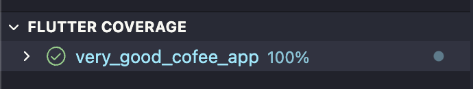
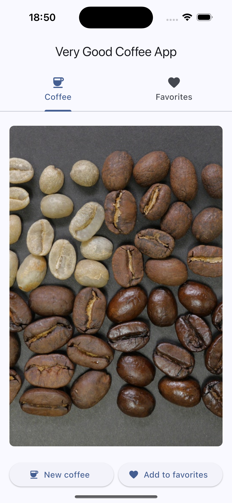

# Very Good Coffee App ☕

Hello VGV team 👋

Thank you for reviewing my assessment project. Guided by the provided **Coding Values**, **Technical Requirements**, and **User Requirements**, I have developed this application with attention to quality and clarity:

✓ **Robust, clear, and consistent architecture:** Although the app is intentionally simple, I have applied principles from the [Android Architecture](https://developer.android.com/topic/architecture) to provide a scalable and maintainable structure. Abstract classes define clear points of interaction for users, ensuring data sources cannot be accessed directly. Client classes encapsulate dependencies on external packages, minimizing the risk of future breaking changes and making updates easier to manage.

✓ **Comprehensive tests:** The project achieves 100% code coverage, and I have followed Test-Driven Development (TDD) by writing unit tests before the implementation code. I have also created integration tests to validate the application flows.



✓ **Readable and understandable:** The project features a clear folder organization, descriptive method names, and thorough documentation, making it easy for anyone to grasp the codebase—even on their first visit.

## Features

✅ Loads a random coffee photo from the network as soon as the app launches.

✅ Allows users to refresh and fetch a new photo if the current one is not appealing.

✅ Saves favorite photos locally, keeping them available offline.

✅ Provides clear feedback to users for loading, connectivity, and error states.

<div align="center">
  
  
</div>

## Architecture Diagram
```
            ┌─────────────────────────────────────────────────────────────┐
            │                    USER LAYER (Widgets)                     │
            │  ┌───────────────────────────────────────────────────────┐  │
            │  │             CoffeeTab  │  FavoritesTab                │  │
            │  └───────────────────────────────────────────────────────┘  │
            └─────────────────────────────────────────────────────────────┘
                                        │
                                        ▼
            ┌─────────────────────────────────────────────────────────────┐
            │              PRESENTER LAYER (State Management)             │
            │  ┌───────────────────────────────────────────────────────┐  │
            │  │           CoffeeCubit  │  FavoritesCubit              │  │
            │  └───────────────────────────────────────────────────────┘  │
            └─────────────────────────────────────────────────────────────┘
                                        │
                                        ▼
            ┌─────────────────────────────────────────────────────────────┐
            │                        DATA LAYER                           │
            │  ┌───────────────────────────────────────────────────────┐  │
            │  │  Repository (CoffeeRepository)                        │  │
            │  │  ├── Remote Data Source (CoffeeRemoteDataSource)      │  │
            │  │  └── Local Data Source (CoffeeLocalDataSource)        │  │
            │  │  Models (CoffeeModel)                                 │  │
            │  └───────────────────────────────────────────────────────┘  │
            └─────────────────────────────────────────────────────────────┘
                                        │
                                        ▼
            ┌─────────────────────────────────────────────────────────────┐
            │                       CLIENT LAYER                          │
            │  ┌───────────────────────────────────────────────────────┐  │
            │  │        MainHttpClient  │  SharedPreferencesClient     │  │
            │  └───────────────────────────────────────────────────────┘  │
            └─────────────────────────────────────────────────────────────┘
                                        │
                                        ▼
            ┌─────────────────────────────────────────────────────────────┐
            │                      PACKAGES LAYER                         │
            │  ┌───────────────────────────────────────────────────────┐  │
            │  │                   http  │  shared_preferences         │  │
            │  └───────────────────────────────────────────────────────┘  │
            └─────────────────────────────────────────────────────────────┘
```

## Getting Started

Follow these steps to set up and run the project locally:

### 1. Clone the Repository
Clone the repository to your machine:
```bash
git clone https://github.com/leandromichelforte/very-good-coffee-app.git
```

### 2. Install Dependencies
Navigate into the project directory and fetch all dependencies:
```bash
cd very-good-coffee-app
flutter pub get
```

### 3. Run the Application
Launch the app on your preferred device or emulator:
```bash
flutter run
```

## Running Tests

### 1. Unit Tests
To execute the test suite and verify functionality, run:
```bash
flutter test
```

### 2. Integration Tests
To execute the integration tests, run:
```bash
flutter test integration_test/
```

## Environment

I strive to minimize dependencies, only including packages that truly add value to the project. Here are the ones I couldn't resist using:

- [fvm](https://fvm.app/): [✓] Flutter (Channel stable, 3.38.3, on macOS 15.6.1 24G90 darwin-arm64, locale en-BR).
- [http](https://pub.dev/packages/http) since the request is a simple GET with only the URL.
- [shared_preferences](https://pub.dev/packages/shared_preferences) for local storage. It's easier than `flutter_secure_storage` since the favorites are stored as a `List<String>`.
- [mocktail](https://pub.dev/packages/mocktail), [bloc_test](https://pub.dev/packages/bloc_test), and [integration_test](https://docs.flutter.dev/testing/integration-tests) for testing.
- [flutter_bloc](https://pub.dev/packages/flutter_bloc) for state management.
- [get_it](https://pub.dev/packages/get_it) for injection.
- [equatable](https://pub.dev/packages/equatable) for equality.
